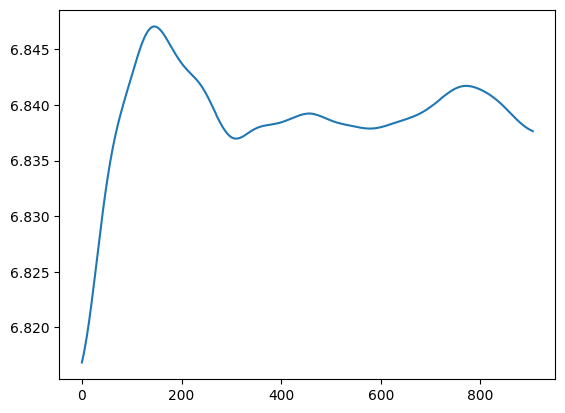
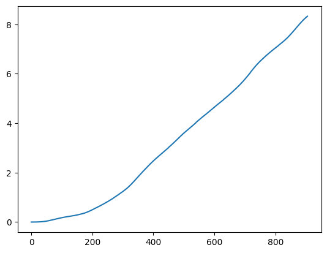

## pyspark并行化Lindemann指数的实现

请查看resource/lindemann.ipynb

## 解决问题
这个实现使用spark并行完成lindemann index的求解，旨在解决在目前遇到的 **原方法串行速度过慢**, **数据处理的不合理编排**，和**单机内存不足等问题**。 (性能方面有待测试)

通过MapReduce的方式完成对数据Partion的方差和平均值的求解，并还原到整体的时间范围中，最后得到精确的lindex随时间演化的关系。

## 背景知识
### **化学**: 
**lindemann index**: 在此简称**lindex**， 是一个描述分子动力学中化学结构中的原子熔化程度的指标, 它将由每个原子坐标随时间变化的方差和平均得到。

### **算法**: 
#### **welford**: 
滚动平均，与滚动方差，简单来说即使用上一个时间戳的平均值加上当前时间戳的数据得到当前时间戳的平均值，相比于直接求和求平均避免了数值溢出的问题。
例: mean[i] = (mean[i-1] *(i-1) + mean[i])/i
在pandas处理结构化数据中有 df.expanding.mean() df.expanding.var() 也利用了welford算法完成滚动数值的求和。
https://pandas.pydata.org/pandas-docs/version/0.17.0/generated/pandas.expanding_var.html

**welford算法的并行化**: 请参考: 

https://en.wikipedia.org/wiki/Algorithms_for_calculating_variance  关于parallel的部分。
#### **MapReduce**:
MapReduce: 是一种并行化的计算模式, 可以非常好的处理，目前在分布式数据处理上有广泛应用
https://en.wikipedia.org/wiki/MapReduce

### **软件**:

#### **Spark**: 
https://github.com/apache/spark

spark是一款当下流行的大数据处理和分析引擎，他提供多种语言的api，和对hadoop, SQL等支持, RDD数据的计算操作并不直接立即执行，而是产生对应的血缘关系(lineage), 以DAG的形式描述在必要时统一执行。

#### **MDAnalysis**: 
https://github.com/MDAnalysis/mdanalysis

Python语言下的 处理多种format 化学轨迹的软件, 类似于现有一些大数据流处理框架的处理方式，他并不直接将数据结构化到内存中，而是获取文件中，时间帧对应的起始偏移量信息，将随机读取转换为顺序读取，避免直接载入到单机内存。

### **RESULT SHORTCUT**: 
简单的可视化 证明数据能复现 : )

#### **lindemann index**

#### **running mean**

#### **running variance**

## **Install Short Guide**
使用此jupyter notebook，请确保
1. java环境 (openjdk 11 for development)
2. spark (version 3.0.3)
3. hadoop (version 3.3.3)
4. conda 环境下: pyspark, MDAnalysis, numpy， jupyter等 

